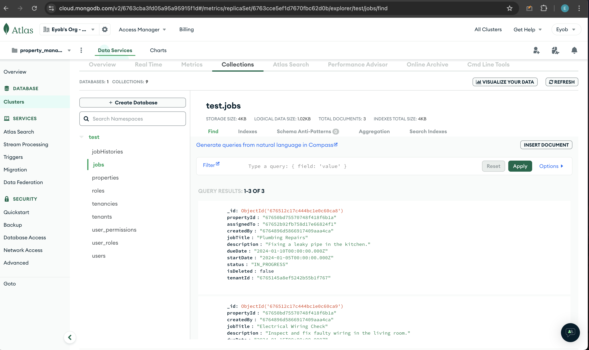

# Property Management Microservice

Welcome to the **Property Management Microservice**, a robust, multi-tenant system designed to manage properties, tenancies, jobs, and authentication seamlessly. This architecture comprises the following four core services:

## Services Overview

1. **Authentication Service**

   - Manages user authentication and authorization.
   - Implements permissions and guards to ensure secure access.

2. **Gateway Service**

   - Acts as the entry point to the microservice architecture.
   - Handles all API requests and routes them to the appropriate service.

3. **Job Management Service**

   - Manages job-related functionalities, including job creation, updates, and job history tracking.

4. **Property Management Service**
   - Handles functionalities related to property and tenancy management.

## Database Design

Below is a preview of the database design:


For a detailed view, visit the database design on [dbdiagram.io](https://dbdiagram.io/d/property_manager_test-67639a0284c7410727270faa).

## Instructions to Run the Project

Follow these steps to set up and run the project:

1. **Clone the Repository**

   ```bash
   git clone <repository_url>

   ```

2. **Install Dependencies Open each microservice folder in four different terminal windows and run the following command:**

   ```bash
   npm install

   ```

3. **Set Up Environment Variables**

- Request the `.env` file for each microservice from the developer, or create your own `.env` files based on the `.env.example` file available in each folder.

4. **Install Kafka**

- Ensure Kafka is installed and running on your machine. Follow the official [Kafka Quickstart Guide](https://kafka.apache.org/quickstart) for installation instructions.

5. **Start the Microservices**

- In the four terminal windows, run the following command to start the services in development mode:

  ```bash
  npm run start:dev

  ```

6. **To test the apis on your local postman download and use this**

- 

## Screenshots for the Microservices project:

- Below is a preview of the database on mongod db atlas:
  

- API Request `/api/tenants/dashboard`:
  

- API Request `/api/properties/search`:
  

- API Request `/api/jobs/assign`:
  

- API Request `/api/jobs/status`:
  

## Additional Notes

- Ensure all dependencies are installed and Kafka is correctly configured before starting the services.
- For any questions or assistance, contact the developer.
